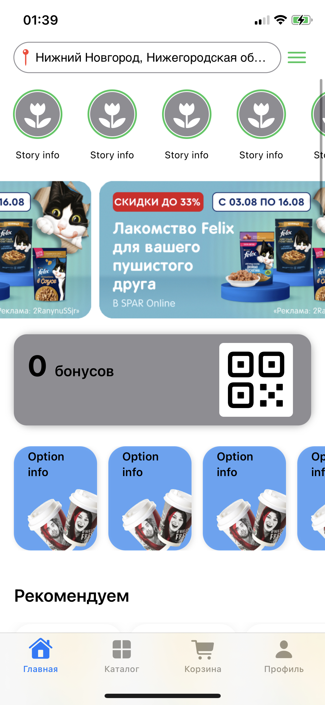
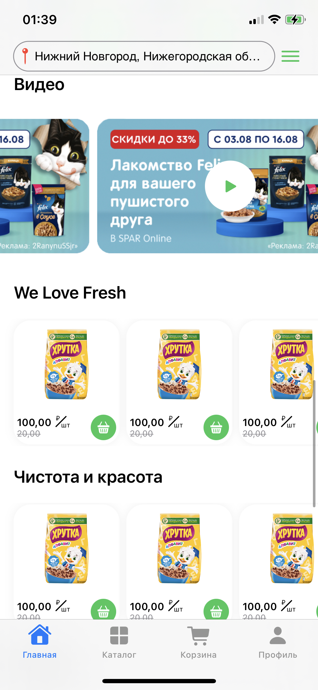
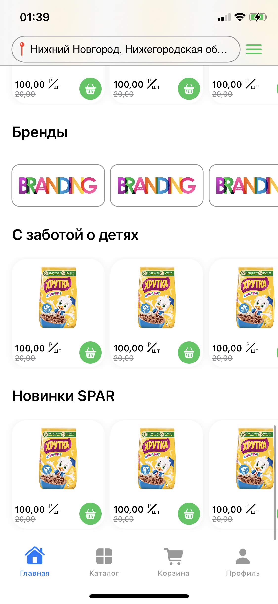

# Spar

Spar is a SwiftUI-based iOS app that utilizes the MVVM architecture pattern. It features a main page with endless carousels.

## Features

- **MVVM Architecture**: Spar is structured using the Model-View-ViewModel architecture pattern, promoting separation of concerns and maintainability.
- **SwiftUI Interface**: The user interface is built entirely with SwiftUI, enabling a modern and dynamic user experience.
- **Endless Carousels**: The main page of the app includes endless carousels, providing users with a seamless browsing experience.

## Screenshots

 
 

## Getting Started

To run Spar on your iOS device or simulator:

1. Clone the repository to your local machine.
2. Open the project in Xcode.
3. Build and run the project on your desired device or simulator.
